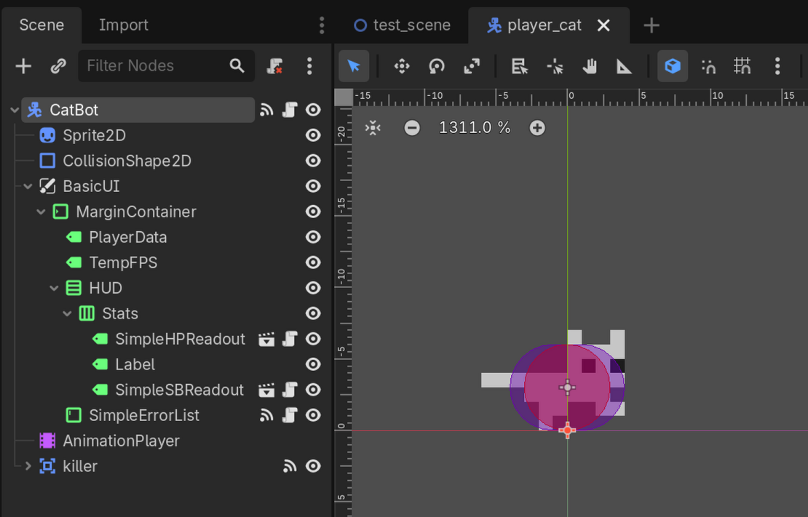
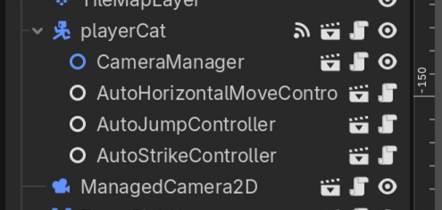
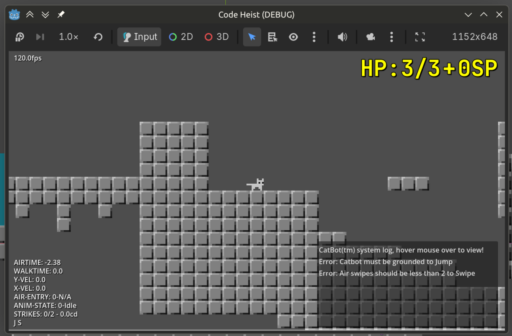

Note:
The the first 3 weeks were written retroactively, so may be inaccurate and less detailed.
I also decided to combine the general dissertation log with this to have one markdown file for all of it.

# Week 01

- Wrote the initial report, including the draft plan, the most important details listed below [Figure 1.1]

> | Phase  | Weeks | Work |
> | ------ | ----- | ---- |
> | 1      | 1 - 2 | Initial Report, background research and requirements |
> | 2      | 3 - 8 | Game development, plus creating surveys |
> | EASTER | 3 weeks | Float and surveying time |
> | 3      | 9 - 10  | Evaluation |
> | 4      | 11 - 12 | Report writing and submission time |
>
> ***Figure 1.1*** *Summary of the work plan.*

# Week 02

- Did some background research.
- Drafted requirements document (Full requirements will be done after CatCode).
- Created repo, github actions and pages deployment.

# Week 03

> 
>
> ***Figure 3.1*** *The node structure of catBot at the end of this stage of development, including node structure of the intermediary ui.*

- Canabalised the following systems:
    - `player_cat` (removed climbing, wall jumping, ledge kicks etc.),
    - `test_level_00`, `test_level_01`, `test_level_02`,
    - Camera systems
- Executed phase 2 of CatBot development, separating out control of **jumping**, **striking** (swiping) and **horizontal movement** to child nodes (requires manual instancing in levels as child of CatBot) [see figure 3.1].
- Created the **basic error system** alongside validators on functions accessible to the player.
- Created **intermediary UI** [see figure 3.3]. 
- Created docs.

**Created release alpha version 0.3:** This was done because this was the first major milestone of development. A branch was created at the end of the week for future reference.

> 
>
> ***Figure 3.2*** *Node structure of an instanced catBot*

> 
>
> ***Figure 3.3*** *The intermediary ui, including some errors generated from disabling the safety on the auto controllers.*