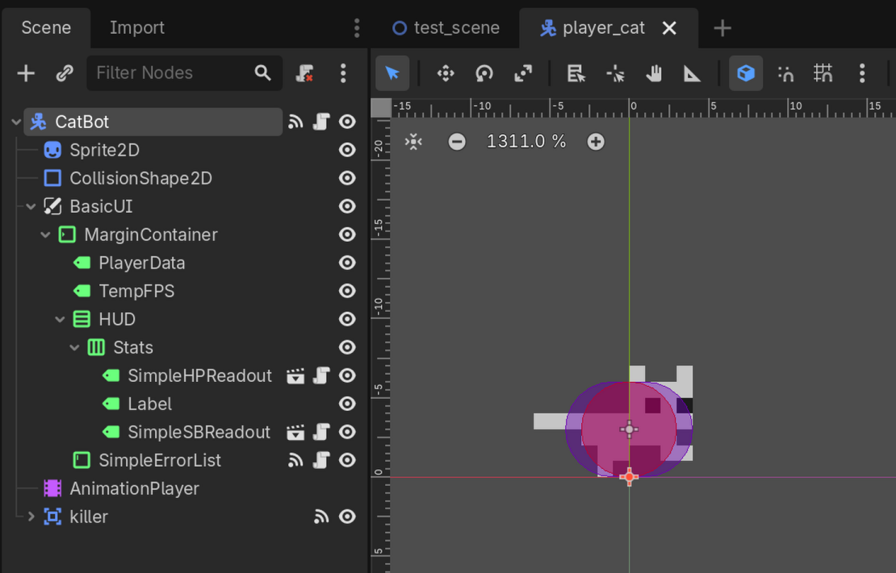
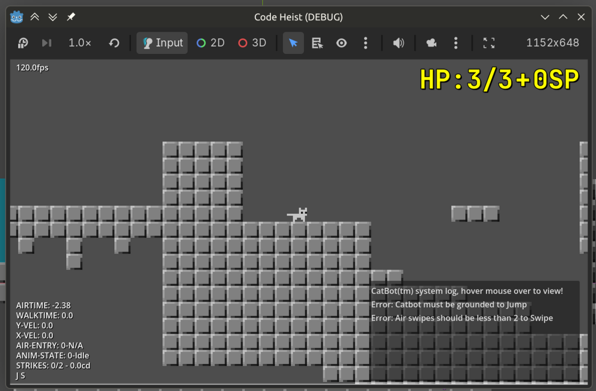
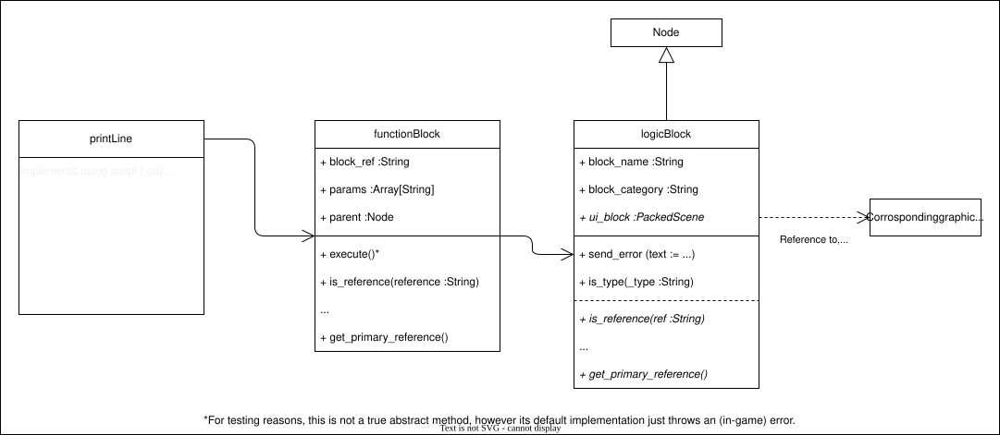
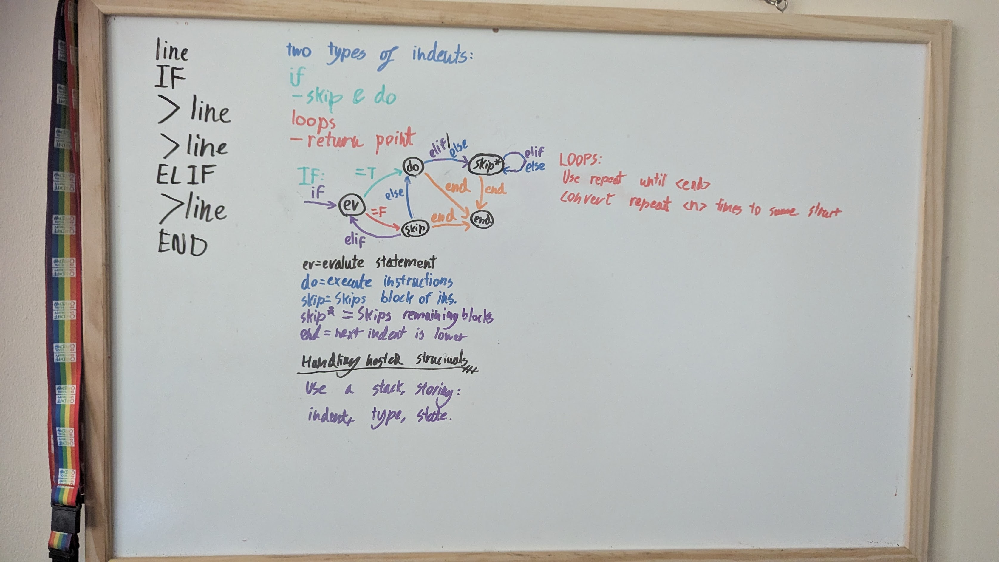

Note:
The the first 3 weeks were written retroactively, so may be inaccurate and less detailed.
I also decided to combine the general dissertation log with this to have one markdown file for all of it.

# Week 01

- Wrote the initial report, including the draft plan, the most important details listed below [Figure 1.1]

> | Phase  | Weeks | Work |
> | ------ | ----- | ---- |
> | 1      | 1 - 2 | Initial Report, background research and requirements |
> | 2      | 3 - 8 | Game development, plus creating surveys |
> | EASTER | 3 weeks | Float and surveying time |
> | 3      | 9 - 10  | Evaluation |
> | 4      | 11 - 12 | Report writing and submission time |
>
> ***Figure 1.1*** *Summary of the work plan.*

# Week 02

- Did some background research.
- Drafted requirements document (Full requirements will be done after CatCode).
- Created repo, github actions and pages deployment.

# Week 03

> 
>
> ***Figure 3.1*** *The node structure of catBot at the end of this stage of development, including node structure of the intermediary ui.*

- Canabalised the following systems:
    - `player_cat` (removed climbing, wall jumping, ledge kicks etc.),
    - `test_level_00`, `test_level_01`, `test_level_02`,
    - Camera systems
- Executed phase 2 of CatBot development, separating out control of **jumping**, **striking** (swiping) and **horizontal movement** to child nodes (requires manual instancing in levels as child of CatBot) [see figure 3.1].
- Created the **basic error system** alongside validators on functions accessible to the player.
- Created **intermediary UI** [see figure 3.3]. 
- Created docs.

**Created release alpha version 0.3:** This was done because this was the first major milestone of development. A branch was created at the end of the week for future reference.

> 
>
> ***Figure 3.2*** *Node structure of an instanced catBot*

> 
>
> ***Figure 3.3*** *The intermediary ui, including some errors generated from disabling the safety on the auto controllers.*

## Week 04

- Finished playerCat documentation (for now), including class diagrams where applicable.
- Developed the (somewhat) abstract classes for **catCode** and created **catCode manager**.
- Implemented the first **logical blocks**. [See figure 4.1]
    - `print`, `print2`
- Implemented the first **compiler**.
- Drafted the **conditional** cycle. [See figure 4.2]
- Started implementing **conditional blocks**.

> 
>
> ***Figure 4.1*** *Partial class diagram for catCode. Showing implementation of the basic function. Certain methods have been omitted. Abstract classes and methods have been shown in italix.*

> 
>
> ***Figure 4.2*** *Whiteboard photo of initial planning for the conditional cycle*

## Week 05

- Implemented textual **conditional blocks** `if`, `elif`, `else`, with hardwired output as well as a the **indent stack**.
- Implemented `boolean_operator` and `boolean_value` which allows `true` and `false` blocks.
- Designed and planned iteration.
- Implemented `repeat(n)` and `repeatForever()`.
- Started documenting catCode

## Week 06

- Continued documenting **catCode** (it turned out to be a lot more than initially anticipated)
- Continued hacking away at **text-based catCode** (specific functions were not noted)

## Week 07

- Finished **text-based catCode** (finally).
- Linked **catBot** and **catCode**.
- Implemented different compilation and execution options 
- Added alternative catCode instances.
- Threading, and **catThread**.

### Next Steps

- Continue documenting catCode.

*Either*

- Work on visual catCode (no more than 2 working days)
- Start working on levels (should be done by the end of easter)

- **week 8** Work on evaluation plan(s).

