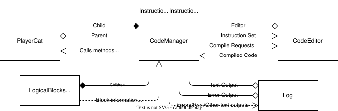
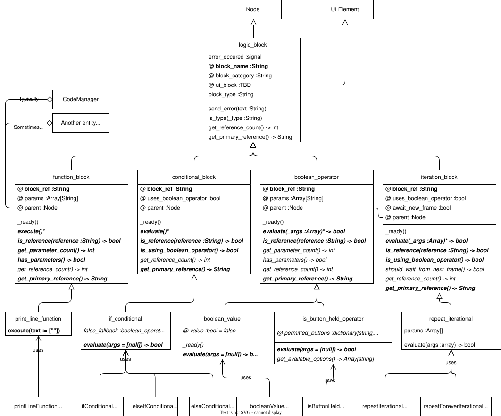
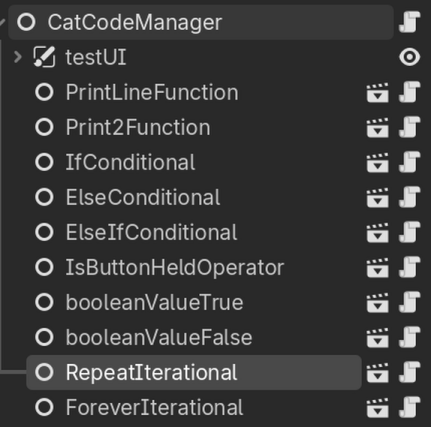
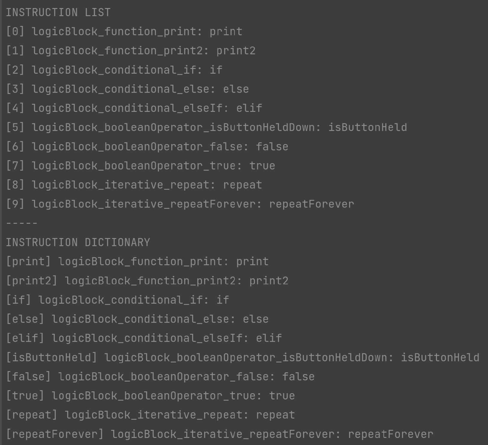
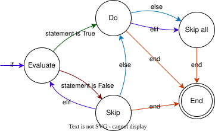

Note: In the godot style guide difference cases in variables correlate to different things, as a general rule of thumb `camelCase` refers to nodes, whereas `snake_case` refers to classes and variables. Where possible, this convention has been followed.

Note: all code blocks are reference to by their reference.

# Cat Code

CatCode was planned as a Scratch-like programming language specially designed to interface with playerCat.

> This section will first describe the overall structure of the systems that collectively became known as catCode and the rationale behind this. It will then describe how code is interpreted and executed by the the `codeManager` node, followed by a more detailed explanation of the individual components of the language such as selection and iteration. Finally it will describe the UI used to code things.

## Overview

> 
>
> Simplified overview of the components that make up the catCode system.

As shown above, the `codeManager` is instantiated as a child node of what it controls, in most cases this will be a player. This is done this way to allow the codeManager can be applied to other nodes, provided valid logical blocks are provided. The instruction set is defined by `logicBlock`s (using the `logic_block` set of classes, described later) instantiated as children of the codeManager. This method was done to allow for drag and drop editing of instruction sets within the godot editor.

The editor and logs are separated out from the `codeManager` node to follow object orientated design good practice. This proved to be a good decision very quickly as it allowed for the interpretation of code to be separated out from the compilation of it, which meant that during development a simpler text based language could be created. The direct communication between the editor and manager will be detailed further throughout this section.

Finally, there is the instruction set. This is defined by two variables, the `instruction_list`, which contains a list of all the instructions available to a given instance of the code manager, and the `instruction_dict` which contains all the possible commands and references to their `LogicBlock`s.

The following table contains a brief guide to what everything does.

> | Node(s) | Variable | Responsibilities |
> | ------- | -------- | ---------------- |
> | Player Cat | `parent` | Executes movement functions such as `jump()` |
> | Code Manager | *this node* | Runs code, calling all methods. Constructs instruction set. |
> | Code Editor | `editor` | Edits and compiles the code. |
> | Log | `text_output` | Handles text outputs, implementing method `print_line(message)`. | 
> | Error Log | `error_output` | Outputs error messages, if unassigned, this will be handled by the logger. |
> | Stability Target | `stability_target` | The entity that will be damaged by errors. |
> | Instruction Source | `instruction_source` | The children of this node are used to compile the instruction set |
> | Logic blocks | *N/A* | Stores both the metadata and methods for a block. |
>
> Table of responsibilities for each node, and how they are referenced by the `codeManager`

## The `logic_block` set of Classes

The `logic_block` set of classes, sometimes semantically called the LogicalBlocks, and handle the backend functionality of the blocks. These store the metadata and implementation of the function that operate a given block. There are multiple different types of blocks, explained below and in the class diagram below. Godot does have interfaces, instead abstract classes had to be used, nor does it support multiple inheritance, this is partially the reason for the messy implementation.

In terms of file structure, the "logicBlock" directory is separated into two folders: "nodes" and "scripts", with superclasses stored with the other catCode superclasses. The nodes (.tscn files) were separated off like this so that there is a folder containing only the nodes that can be dragged on dropped to add them to a codeManager.

> 
>
> Class diagram detailing the LogicalBlock class group.
>
> Note: This only shows a limited number of subclasses. `@Export` variables (editable by an instance node in the editor) are denoted by an "@". Abstract classes and methods are listed in italix. The most important variables and methods are in bold. All methods and variables, due to the nature of gd-script, are public so the private and public symbols have been omitted. 
>
> *Not a true abstract implementation, rather the default implementation of the function throws an in-game error.

### Logic_block

Logic block is main superclass. It defines a few abstract methods, that other classes use. Most of the methods declared here are defined in the next layer of classes. This superclass exists to define the core attributes and to allow stricter typing within variables later on.

### Function_block

Function block is used for functions. Like all the other block categories, this superclass adds `block_ref` a string that identifies the block. Also similar to all the other classes, the `on_ready()` function sets the node's name to `"logicBlock_function_" + block_name.to_camel_case()` and the parent (if not overridden in the .tscn) to the `parent` node, which is the origin of this variable's name. Unless specified otherwise, this is the same in the other logical blocks.

Parameters are specified in the `params` array semantically, however only considered in the `execute()` function. The `execute()` function is the only remaining function (or variable) left to be defined by the subclasses that implement the catCode functions. Parameters are provided to the execute array using an array due to the structure of "compiled" code.

### Conditional_block

The `conditional_block` superclass was constructed for `if`, `elif` and `else` statements. Ultimately all of these methods could be defined using the `if_conditional`, however this class was kept in case future statements were added that could not be done using this subclass.

The logic for conditional blocks are mostly handled by the code manager, except for evaluation which is handled by a subclass. The `evaluate()` method, when `uses_boolean_operator()` is true, uses the boolean operator specified within the first slot (index 0) of `args` array with any other parameters provided in the second slot.

### Boolean_operator

The `boolean_operator` superclass does not provide much function by itself. Instead it's blocks are designed to be used by `conditional_blocks` and other statements that can be evaluated. A boolean operator has a single function: return true or false when `evaluate()` is called based on the arguments. These blocks, more than others, make use of the @export annotation, such are `value` for `boolean_value` or the permitted buttons for `is_button_held`

### Iteration_block

The `iteration_block` superclass was constructed for `repeat` and `repeatForever` blocks. Due to time constraints `repeat_until` was not implemented, however it is expected that this would take a similar structure and implementation to `if`. Similar to conditional blocks, the implementation, execution and logic behind these is handled by the compiler.

The only attribute unique to the `iteration_block` is `await_new_frame`, which denotes whether the interpreter will wait until the next frame before repeating. It was decided that for most, if not all, player use of this block, this will be the case. This is also how scratch and many other visual programming languages for learners works and aligns closer to what people expect when they place a loop (rather than the alternative scenario where everything happens at once). 

**TODO: Check factuality**

## Creating an Instruction Set

> 
>
> Example instance of a codeManager. This exact example was from the self contained first prototype of this system.

The instruction set, for the level designer, is defined by dragging and dropping `logic_block` nodes from the exploring onto the `codeManager` node. Example shown above. Certain nodes may need configuration within the inspector. When the codeManager is instantiated, the `update_instructions()` is called which creates the `instruction_list` and `instruction_dict`. 

First, the `instruction_list` is created by creating an array with a reference to each of the instanced logicBlock nodes. This function is able to determine that a block is an instruction block using the nodes name. All the blocks use the naming scheme `logicalBlock_<type>_<name>`, and the below method takes advantage of this.

```gd
## Logic blocks are stored as children of this node, this function fetches theme all. [br]
## Due to quirks in the engine, it was determined that using names was the best way of doing this...
func get_logic_blocks(source := self) -> Array[logic_block]:
	print("-   Updating instruction list...")
	var children = source.get_children()
	var logical_children :Array[logic_block] = []
	for child in children:
		if child.name.split("_")[0] == "logicBlock":
			print("-     Added " + child.name)
			logical_children.append(child)
		else:
			print("-     Rejected " + child.name)
	return logical_children
```

From this, the `instruction_dict` dictionary is created from the list by iterating across add of the elements executing `instruction_dict.set(this_block.get_primary_reference(), this_block)`. Beforehand, the function checks to see the reference count. At present there are no blocks that have multiple references, which means there is no implementation for this scenario.

Finally, the `instructions_updated(new_list :Array[logic_block], new_dict :Dictionary[String, logic_block])` signal is emitted, which carries both the list and dictionary. The finished list and dictionary for the above example is shown below. Note that this is a aggregational relationship not a compositional one, meaning that is either of the variables are updated, the nodes are not unloaded.

> 
> 
> Completed `instruction_list` and `instruction_dict`. Note: each node is presented by the string `<name>: ref`, 

## Compiling code

Code is compiled by the editor. This was done so that the editor can be swapped out and to obey object orientated programming best practice.

**TODO finish**

### Compiled Code

The "compiled code" comes in the form of an array of `instruction` class instances. This class stores a reference to the logical block, indent and parameters for a given line, alongside some methods, such as `is_executable_function()`, which aid with execution. Each element of the array corresponds to one line of code.

The quirks of this system are listed below:
- Boolean operators are stored in the parameters of conditional statements in the following format: `[<boolean operator ref>, [<boolean operator arguments>]]`

## Interpreting Code

Interpreting the code is handled by the codeManager. At it's core, the interpreter will run be code line by line, modifying its behavior depending on it's state. There are two elements that effect the state: 1, selection statements (`if`, `elif`, `else` etc.) and, 2, iteration blocks (`repeat`). Each indent falls into either states or is at root, henceforth known as indent types to prevent confusion with pass states.

This, alongside the current indent and pass state, is stored in a stack\* called the `indent_stack`. This stack stores instances of the internal `stateStackLayer` class, the full definition shown in figure idk. In another language such as C# this data could be represented as a struct. Due to the limited number of pass states and layer types, both `type` and `state` are stored using enums. This stack system is analogous to the call stack structure that appears in numerous programming languages.

To explain how `compiled_code` and the `indent_stack` are used, the code interpreter will be explained in the three isolated scenarios: 1, sequential interpretation, 2, conditional structures, 3, iterative structures; followed by the final combination, including nested iteration and selection.

> ```
> ## Enum for the states of how a code will be treated: [br]
> ## DO: will result in the code being executed,
> ## SKIP_1: will skip until the next control statement of proper indent,
> ## SKIP_ALL: will skip to the end of the indent.
> enum PASS_STATES { DO, SKIP, SKIP_ALL}
> ## Enum for the type of layer in the indentStack
> enum STACK_LAYER_TYPE { NONE, CONDITIONAL, ITERATIVE }
>
> ...
>
> class stateStackLayer:
>	var indent :int
>	var type :STACK_LAYER_TYPE
>	var state :PASS_STATES
>	var rep :int
>	var entry :int
>	
>	func _init(_indent :int, _type :STACK_LAYER_TYPE, entry_state :PASS_STATES, _entry :int) -> void:
>		indent = _indent
>		type = _type
>		state = entry_state
>		entry = _entry
>		rep = 0
>	
>	func _to_string() -> String:
>		return "<" + str(indent) + ": t:" + str(type) + " s:" + str(state) + " r:" + str(rep) + " s:" + str(entry) + ">"
> ```
>
> Figure idk extract from `cat_code_manager.md` showing the definition of the enums `PASS_STATES` and `STACK_LAYER_TYPES` as well as the full definition of the `stateStackLayer`

\*Godot does not have dedicated stack data structures, however the array implements the methods `push_back()`, `back()` and `pop_back()` that allows interaction with an array as if it were a stack. For clarity, top of the stack refers to the same index as back of the array.

### Sequential interpretation

This is the simplest of our scenarios. In this scenario, there are a series of instructions that must be interpreted in order.

**TODO finish**

### Conditional structures

This scenario represents a structure consisting of `if`, `else` and `elif` statements. This was what the pass states were created for. In essences there are 5 states: evaluate, do, skip, skip all, and end as shown in figure idk-3. Because evaluate and end are purely function and do not persist for more than one loop, therefore do not possess pass states.

> 
>
> Figure idk-3: State diagram for interpreting

When an `if` statement is reached, whilst in a `DO` pass state, two things happen. First, the statement is evaluated and then a new stack layer is added to the `indent_Stack` of an indent one higher than the current layer. If the result is true, the pass state will be set to `DO`, else, it will be set to `SKIP`.

Following this, when checking for an `elif` or `else`, the code manager will check the second item from the top of the stack (index -2)\*\* and then will act accordingly if the indent and state of that layer is correct. If it reaches an `else` statement of appropriate indent, it will switch to the opposite pass state, `DO` for `SKIP` and `SKIP_ALL` for `DO` respectively. `elif` is more complex having three potential outcomes. First, if the current pass state is `SKIP`, it will evaluate the line's operator, setting the top stack layer to `DO` if the operator is true, `SKIP` if not. If the current pass state is `DO`, it will set it to `SKIP_ALL`.

There is no true "end" statement, instead it will assume it is the end of a block when the indent of the next line is lower than the current stack and it is not an appropriate statement. If this is the case, the current top of the stack will be "popped" using the `pop_back()` method. This is one of the cases where the `line_number` is **not** incremented in case as this process needs to be repeated for every indent until the indent is once more where it is meant to be.

This logic did not need to be modified to allow the use of nested structures due to the use of the indent stack.

> **TODO:** Decide if this is worth the trauma or drawing.
>
> Figure idk-6: Flow chart showing one cycle of a conditional structure.

As stated before, `boolean_operators` are handled by the relevant `iterable_blocks` similar to how `function_blocks` handle parameters with the first index being the `logic_block` and the second containing the parameters. For example, `if(isButtonHeld(up))` will have the following `line` value:

```
instruction{
	...
	primary_block = if
	parameters = [isButtonHeld, "up"]
	...
}
```
To evaluate this, one would call the following method: `line.primary_block.evaluate(parameters)`, similar to a function call. It is within the `evaluate()` function defined within `if` that `isButtonHeld.evaluate(["up"])` is called.

\*\*To prevent errors, this test is only done if the size of the stack is greater than 2. This is possible because it is impossible for an selection `elif` or `else` statement to be reached by default (assuming correct code) as they must appear after an if, which will always increase the stack size to a value of 2 or higher.

### Iterative structures

**TODO finish**

### The full picture

**TODO finish**

## The Graphical Editor