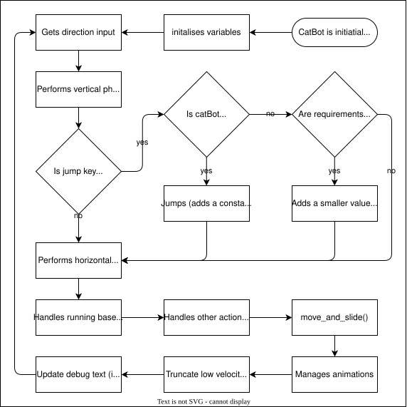
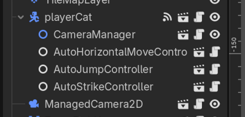
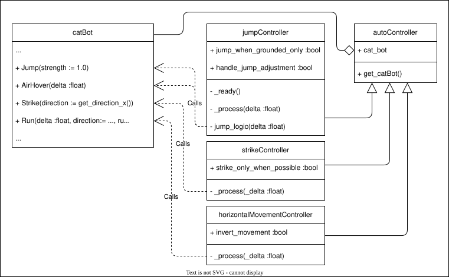
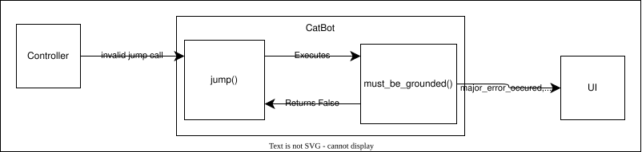

# Control

Before detailing the player character, first a note on controls. All inputs for this game are handled by Godot's built-in input system. This was done to allow controller remapping and because it's good practice to avoid using hardwired inputs.

The player has access to two buttons in code, alongside each direction. This was done partially done as an homage to old game systems such as the NES, which had access to less inputs, but also prevent overwhelming the player with options. By default these two buttons are mapped to the `Z` (or `space`) and `X` key because these keys are easy to find on the keyboard and next to each other. Arrow keys were chosen above `W`, `A`, `S` and `D` for movement because it is more intuitive.

# Player cat / Cat bot

CatBot (class name: `player cat`) is the player character. It uses a [`characterBody2D`](https://docs.godotengine.org/en/4.6/classes/class_characterbody2d.html) as this node class is designed "for physics bodies that are meant to be user-controlled", with the main method of note being `move_and_slide()`, which moves the character body by the `Vector2D` `velocity` whilst handling collision.

As is typical for Godot, CatBot has two main functions:
- `_ready()`, which runs once each time it is instantiated
- `_physics_process(delta)`, which, like `_process(delta)`, is ran every frame, where `_delta` is the duration since the last frame in seconds.

The character was initially built as a more traditional platformer character controlled traditionally, canabalising elements of an existing physics system made by the author. From here, the control mechanisms were exacted out to separate nodes to make this system more modular. The final step was then to create "CatCode", a custom programming system that could replace the modular controllers. To help explain the final system, each of these three stages and the changes between them will be detailed below. But first, I shall describe the main mechanics associated with the character as these remained unchanged throughout the process.

## Mechanics

### Horizontal movement

Horizontal movement is intuitive, one just has to set `velocity.x` to a value to move. For smooth movement, rather than setting `velocity.x` to a constant value, the constant `SPEED*delta` is added to `velocity.x`. For deceleration/friction, this are rather more complicated as a result of friction being non-linear, however this was solved using the function below:

```gd_script
## Handles horizontal physics, which is pretty much just friction and air resistance
func horizontal_physics(_delta: float, direction: float) -> void:
	var slipmod_adjustment := 1.0 if abs(direction) > 0 else SLIPMOD*0.75
	velocity.x = lerp(velocity.x, 0.0, FRICTION_CONST * slipmod_adjustment)
```
Note: direction is a variable representing the horizontal input, -1 being left, 1 being right.

This is the primary system where a second layer of constants were used, in the code referred to as meta-constants, which were used to calculate the values of other constants.

### Jumping and vertical movement

Every frame, when not grounded (determined by `is_on_floor()`, a method provided by the `characterBody2D` class), the a value is added to `velocity.y`\*. This represents gravity as is defined globally in the game's internal setting for all physics objects to follow. As well as this, `delta` is added to `air_time` to represent how long the character has been airborne.

Jumping is logically very simple, press button when grounded to gain vertical velocity. However there are two thing that can be done to make jumping feel nicer. Firstly coyote time, described as [find citation explaining this]. This was implemented by replacing the `is_on_floor()` in the `can_jump()` function with `(air_time <= COYOTE_TIME)`.

The other is by adjustment of the jump height by holding down the button. In this project this is called air hovering. #TODO: explain.

\*This value is added rather than subtracted because in godot's 2D engine, the y-axis is inverted.

### Swiping

This was added as a example secondary action. This was be done endless on the ground, or twice in midair. In summary, this works similarly to jumping, except rather than checking whether the player is grounded, it will compare `air_strikes` (a variable which is incremented for every strike, and reset to 0 once grounded) to the constant `MAX_AIR_STRIKES`.

Two things occur when a strike is successfully triggered:

1. The player gets a impulse of velocity (determined by constant `STRIKE_VELOCITY`).
2. An attack node is spawned as a child of the player that exists on the damage collision layer to damage enemies for a brief moment.

## Stage 1: Tradition

The original system, as stated before, was copied from another project the author developed. This character copied was far more complex than what was required for this project which resulted in some elements getting removed such as wall climbing and jumping. The constants and animations associated with these systems were, however, kept in the script in case these mechanics were reintroduced later.

The `_physics_process()` in this stage functioned shown below alongside a flowchart explaining the process. In summary, it does the following in order every frame:

1. Handles vertical movement
2. Handles jump logic
3. Handles horizontal physics
4. Handles any other actions
5. Moves
6. Handles animations

Vertical (steps 1 & 2) and horizontal logic (step 3) are separated in order as an artefact of this architecture being developed for a platform where collision had to be handled manually. This architecture was continued in future, even when this was no longer necessary as it is logical, easy to understand order to perform these steps in. This function, beyond removing functions such as `jump_logic()`, remained mostly unchanged in later stages of development.

```
# Main Processes
#===========================================

func _physics_process(delta: float) -> void:
	var direction := get_direction_x()
	debug_text = ""
	animation_state = 0

	# Air physics
	calculate_airtime(delta)
	vertical_physics(delta)

	# Handle jump
	calculate_walktime(delta, direction)
	jump_logic(delta)

	# Ground physics
	running_logic(delta, direction)
	horizontal_physics(delta, direction)

	# Other
	strikes(delta, direction)

	previous_velocity = velocity
	facing_right = velocity.x >= 0
	move_and_slide()

	# Animations
	flip_sprite(direction, false)
	calculation_animation_state(direction, delta)
	animation()
	update_debug_text()

	# Sets velocity.x to 0 if it is low enough
	velocity.x *= 1 if (abs(velocity.x) >= delta*5) else 0

	# Debug
	if Input.is_action_just_pressed("debug_damage"):
		damage(1)
	if Input.is_action_just_pressed("debug_heal"):
		heal(1)
```

> 
>
> Flow chart summarizing the the main loop used by CatBot

It is also worth mentioning that `player_cat` is a child class of `generic_entity`. This class does not affect the physics logic for the player, instead providing general utilities such as `is_type()` (and associated methods/variables) and defining damage functions and signals. This relationship will be described in proper detail in stage 2 as it's functionality was extended to include the stability system in that stage.

## Stage 2: Modularization

Stage 2 of the process is where catBot started to match it's final form. In this stage, the functions which controlled catBot were removed and placed in nodes that can be instanced as a child of catBot in a scene in order to perform the same function.

> 
>
> Node setup to instance catBot in a scene at this stage.

Using jumping as an example, the jumping logic, originally contained entirely within `jump_logic()`, into one function for the performing of the action (i.e. modifying the velocity), `jump()`, and another that calls the first, `jump_logic()`.  From here, a node can be created, `AutoJumpController` in this example, which the logic function can be moved to\*.

> ```
> ## Jumps. [br]
> ##
> ## [strength] determines the strength of the jump as a fraction of [JUMP_VELOCITY]
> ## between -1.0 and 1.0.
> # TODO: test
> func jump(strength := 1.0) -> void:
> 	# Checks for errors
> 	if !(
> 			must_be_within_range(strength, -1.0, 1.0, "Jump strength") and # Checks that strength is valid
> 			must_be_grounded("Jump") and # Checks if grounded
> 			can_jump() # Back-up, legacy test
> 		):
> 		return
> 	# Preceding if none occur
> 	else:
> 		air_entry = 3
> 		air_time = 0
> 		# Modifies jump strength depending on if air hover is used, this is to prevent punishing
> 		#	players who do not use air hovers
> 		velocity.y = JUMP_VELOCITY * strength * 0.95 if using_air_hover else JUMP_VELOCITY * strength * 1.1
> 		first_ascent = true
> 		return
> ```
>
> Jump function (in "playerCat.gd")

> ```
> extends auto_controller
> 
> [...]
> 
> func _process(delta: float) -> void:
> 	jump_logic(delta)
> 
> ## Jumping and the floaty part of jumps. [br]
> ##
> ## Contains the logic for:
> ##   Impulse jumps,
> ##   Air hovering
> ##
> ## [br] Uses [direction] for ledge kicks
> ## Uses [delta] to process the floaty part of jumps
> func jump_logic(delta: float) -> void:
> 	if jump_when_grounded_only:
> 		if Input.is_action_just_pressed("primary_action") and cat_bot.can_jump(): # JUMP
> 			cat_bot.jump()
> 		elif cat_bot.is_air_hovering() and handle_jump_adjustment: # That thing where holding down the button can adjust the height
> 			cat_bot.air_hover(delta)
> 	else:
> 		if Input.is_action_just_pressed("primary_action"): # JUMP
> 			cat_bot.jump()
> 		elif cat_bot.is_air_hovering() and handle_jump_adjustment: # That thing where holding down the button can adjust the height
> 			cat_bot.air_hover(delta)
> ```
>
> Extract of "jump_controller.md"
>
> Note: this is the most coplex controller script due to jump containing extra parameters.

When combined with movement and striking, it effectively creates a relationship shown below where the child nodes call functions in the parent. To avoid repeating code, the class `auto_controller` was created, which handled getting the reference to it's parent.

> 
>
> Class diagram dipicting the relationship between nodes.

Also shown in (jump function), a built-in error handelling system was created. This was required as gdscript has no built in error handling system as it can usually be assumed that all data is valid. This is not a typical scenario. All of the functions that are exposed to player inputs (jumps, strikes, movement etc.) contain validators. These are bespoke functions that return true if the data is valid, but will also send and relavent signals upon an error occuring. All the functions use the same structure: validors then functionality.

Errors and damage are handled in a very similar manner. When one occurs, either `hp` (for damage) or `stability` (upon an error), are decreased, and the corrosponding signal is emitted. This signal is used to update ui elements and carry both the change in value and the new value. Errors also carry an error message.

> 
>
> Simplified diagram dipicting the communications between methods and nodes on a non-grouneded jump call.

\*Note: similar to python, variables and methods in godot are public by default.

## Stage 3: Cat Code
